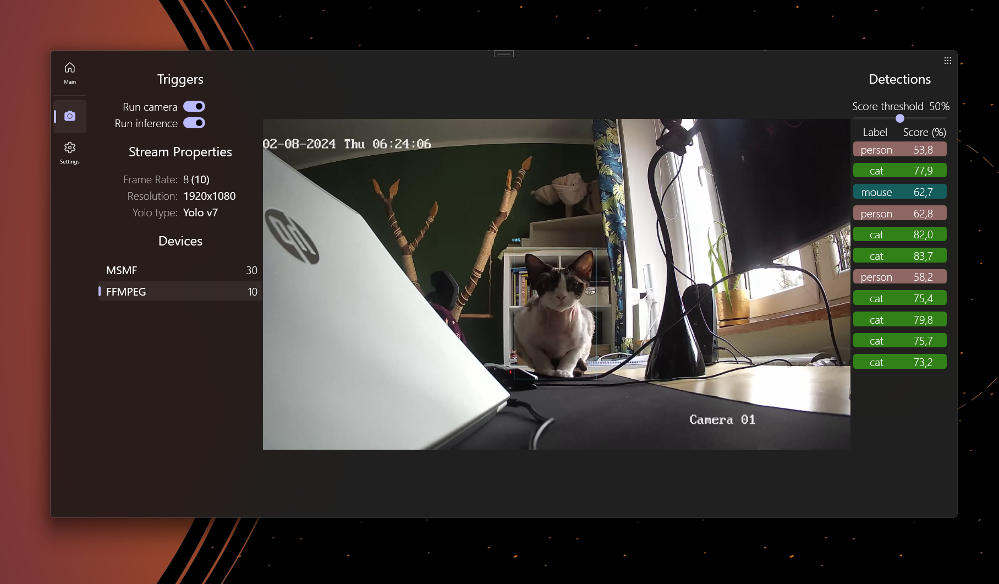

# YOLOV7-Webcam-inference

<div align="center">
    <a href="./">
        
    </a>
</div>

Simple WPF program for webcam inference with yoloV7 models.

Implemenation of ONNX model [yolov7](https://github.com/WongKinYiu/yolov7) inference with webcam cameras.

## What's new 🤗 
- **Multicamera support**
- **Ready to use model** (no export needed)

## Usage
Download .pt model **or use onnx exported model** (in *Yolo* folder)
- [`yolov7-tiny.pt`](https://github.com/WongKinYiu/yolov7/releases/download/v0.1/yolov7-tiny.pt)
- [`yolov7.pt`](https://github.com/WongKinYiu/yolov7/releases/download/v0.1/yolov7.pt)
- [`yolov7x.pt`](https://github.com/WongKinYiu/yolov7/releases/download/v0.1/yolov7x.pt) 
- [`yolov7-w6.pt`](https://github.com/WongKinYiu/yolov7/releases/download/v0.1/yolov7-w6.pt) 
- [`yolov7-e6.pt`](https://github.com/WongKinYiu/yolov7/releases/download/v0.1/yolov7-e6.pt) 
- [`yolov7-d6.pt`](https://github.com/WongKinYiu/yolov7/releases/download/v0.1/yolov7-d6.pt)
- [`yolov7-e6e.pt`](https://github.com/WongKinYiu/yolov7/releases/download/v0.1/yolov7-e6e.pt)

Export pt model to ONNX
**Pytorch to ONNX with NMS (and inference)** <a href="https://colab.research.google.com/github/WongKinYiu/yolov7/blob/main/tools/YOLOv7onnx.ipynb"></a>
```shell
python export.py --weights yolov7-tiny.pt --grid --end2end --simplify \
        --topk-all 100 --iou-thres 0.65 --conf-thres 0.35 --img-size 640 640 --max-wh 640
```
        
Place exported ONNX model in solution folder (e.q. Yolo) and change <b>ModelPath</b> const value in App.xaml.cs file (line 14)

Use <b>Release</b> confguration for better performance.

## References & Acknowledgements

<details><summary> <b>Expand</b> </summary>
        
* [https://github.com/WongKinYiu/yolov7](https://github.com/WongKinYiu/yolov7)
* [https://github.com/ivilson/Yolov7net](https://github.com/ivilson/Yolov7net)

</details>
